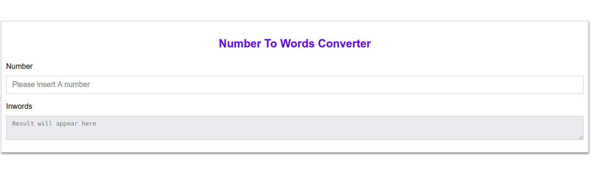

[](https://travis-ci.org/krmroland/number-to-words)

## Number to Words Converter

#### A simple App that converts numbers to figures say 1000 to one thousand.



A working demo can be found [HERE](https://krmroland.github.io/number-to-words/)

### Description

This application uses vanilla `javascript` to convert numbers say 1,000,000 (figure) to words one million

### Installation

Make sure you have nodejs and npm or yarn installed on your local machine if you want to run the tests

```
git clone https://github.com/krmroland/number-to-words.git
cd  number-to-words

# to run the tests
 yarn test or npm run test
```
